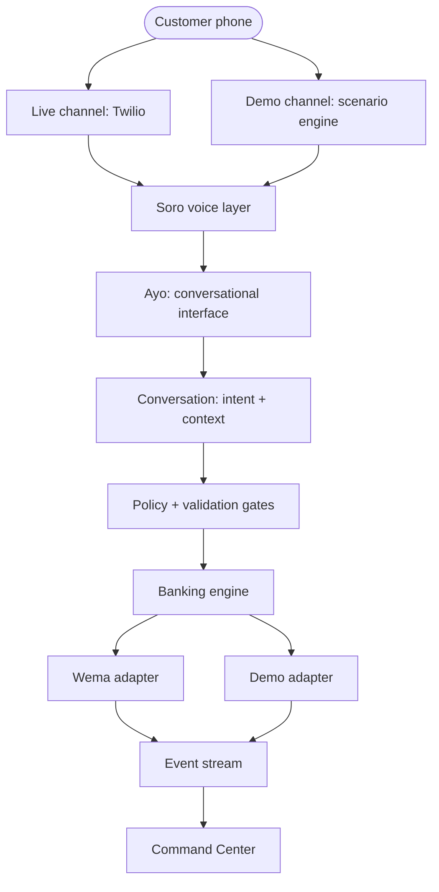
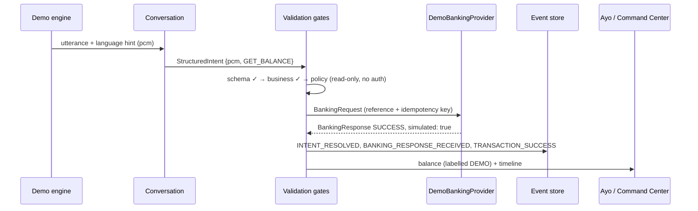

# Soro — Architecture

> **Phase 0 status: FOUNDATION REAL.** Workspace, boundaries, domain model,
> and shells exist and are tested. Service internals and UIs are PLANNED.
>
> Related: PRODUCT.md · SYSTEM-FLOW.md · EVENTS.md · BANKING.md · VOICE.md ·
> SECURITY.md · AI.md · COMMAND-CENTER.md · DECISIONS.md

## 1. Purpose

Define where every piece of Soro lives, what it may depend on, and which
boundaries must never be crossed — so any engineer (or agent) can extend
the system without guessing.

## 2. High-level architecture



AI understands (conversation). Deterministic systems control (gates,
orchestration, banking). Ayo communicates. The Command Center observes.

## 3. Workspace map (REAL — implemented in Phase 0)

```text
soro/
├── apps/
│   ├── command-center/      # @soro/command-center — journey spine (UI: Phase 1)
│   └── web/                 # @soro/web — placeholder (screens: later phases)
├── services/
│   ├── conversation/        # @soro/service-conversation — language continuity
│   ├── voice/               # @soro/service-voice — call lifecycle guard
│   ├── orchestration/       # @soro/service-orchestration — pipeline + txn machine
│   ├── banking/             # @soro/service-banking — provider selection boundary
│   └── events/              # @soro/service-events — persistence + timelines
├── packages/
│   ├── types/               # @soro/types — shared domain model (single source)
│   ├── events/              # @soro/events — envelope factory + guards
│   ├── validation/          # @soro/validation — schema/business/policy gates
│   ├── config/              # @soro/config — grouped, validated env config
│   ├── banking/             # @soro/banking — Demo adapter + Wema stub
│   ├── db/                  # @soro/db — SQLite schema, client, seeds
│   └── ui/                  # @soro/ui — Ayo metadata, mode badges
├── tests/                   # workspace e2e (demo balance inquiry)
├── docs/                    # engineering knowledge base (this file's home)
└── assets/ayo/              # canonical Ayo visual assets (EMPTY in Phase 0)
```

**Deliberate deviations from the Phase 0 brief** (documented, see
docs/DECISIONS.md ADR-0011): `packages/events` (envelope mechanics kept
out of pure types), `packages/banking` (adapters colocated as one
package), `packages/db` (database as a shared package, not a loose
folder) — all to avoid duplicated domain logic.

## 4. Dependency rules

- `packages/types` depends on **nothing**. Everything depends on it.
- `packages/events` → `types`. `packages/validation` → `types` (+ zod).
  `packages/config` → zod only. `packages/banking` → `types`.
  `packages/db` → `types`. `packages/ui` → `types`.
- Services may use packages; services NEVER import each other directly
  (orchestration coordinates at runtime in Phase 1+).
- Apps may use packages; apps never import services directly.
- No package reaches across the AI/control boundary: the LLM proposes
  `StructuredIntent`; only validated intents become `BankingRequest`.

## 5. Component responsibilities

| Component | Owns | Never owns |
|---|---|---|
| conversation | language continuity, intent intake shape | model calls, banking |
| voice | call lifecycle, Twilio boundary | STT/TTS internals (Phase 1) |
| orchestration | pipeline order, transaction state machine | provider logic, prompts |
| banking (service) | provider selection ONLY | credentials, UI |
| banking (package) | Demo adapter behavior, Wema isolation | real Wema endpoints (NOT VERIFIED) |
| events (service) | append-only log, timelines | streaming transport (Phase 1) |
| config | env parsing, demo/live readiness | secrets storage |
| db | schema, migrations, typed repositories | PINs, raw phone numbers |
| command-center | journey spine model | banking authority |
| web | placeholder | — |

## 6. Data flow (balance inquiry, Demo Mode — REAL, tested)



Proven by `tests/demo-balance-inquiry.test.ts` (47/47 tests pass).

## 7. Security boundaries

1. **AI boundary** — LLM output is untrusted text until the three gates
   pass (docs/AI.md, `packages/validation`).
2. **Authorization boundary** — money movement needs confirmation + DTMF,
   enforced by the state machine (`services/orchestration`), never by Ayo.
3. **Secret boundary** — PINs/DTMF never enter LLM context, logs, events,
   transcripts, or the Command Center (docs/SECURITY.md).
4. **Provider boundary** — `BankingProvider` interface; Wema isolated in a
   stub that throws `NotVerifiedError` (docs/BANKING.md, docs/WEMA.md).
5. **Honesty boundary** — every event/row carries `mode`; `simulated: true`
   is structurally required on demo responses.

## 8. Demo vs Live paths

- **Demo**: demo engine → same pipeline → `DemoBankingProvider` →
  events tagged DEMO → Command Center with DEMO MODE badge. Works with
  zero credentials (`isDemoReady` is unconditionally true).
- **Live**: Twilio webhooks → voice gateway → same pipeline →
  `WemaProvider` → events tagged LIVE. Gated by `isLiveReady`
  (currently NOT ready — nothing verified). See docs/TWILIO.md, docs/WEMA.md.

## 9. Command Center architecture (spec for Phase 1)

Event-sourced read model: the UI renders `getTimeline(db, sessionId)`
against `JOURNEY_STAGES`, plus Ayo state (`@soro/ui`) and transaction
state. No separate backend state to drift. See docs/COMMAND-CENTER.md.

## 10. Future production considerations

Project references + dist-first packaging, Postgres migration behind the
`@soro/db` repository seam, message bus (Phase 1 choice documented in
docs/EVENTS.md), horizontal stateless services with sticky call routing.
